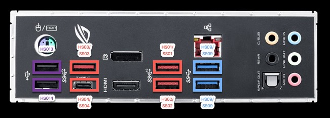

Jump to [Explain BIOS](./config_explain_BIOS.md)

## NZXT H500 USB

Front panel USB uses 3.0 Gen1 instead of 3.0 Gen2.

## Fan Distribution

Location|Fan|Size|RPM|dbA
:----|:----|:----|:----|:----
CPU Cooler (NH-D15) | NF-A15 PWM | 120mm | 300-1400 | 21.4 
Rear (Exhaust) | NZXT Aer F120  PWM | 120mm | 500-1500 | 22 - 31 
Top Rear (Exhaust) | NZXT Aer F120  PWM | 120mm | 500-1500 | 22 - 31

## Asus Z390-F Hardware Info

***Physical View***

 | 

***USB Physical Mapping*** for each port identified in the bios

Physical Port (Bios naming) | Logical Port | Comment
--------------|--------------|--------
G31G2_1       | HS01         | USB 3.1 Gen 2
G31G2_2       | HS02         | USB 3.1 Gen 2
G31G2_3       | HS03         | USB 3.1 Gen 2
G31G2_C4      | HS04         | USB 3.1 Gen 2 Type C + Switch
G31G1_C5      | HS05         | USB 3.1 Gen 2 Type C + Switch
USBE12 (not visible)| HS06   | Internal Aura USB 2.0 Hub
G31G1_7       | HS07         | USB 3.1 Gen 1 Front case
G31G1_8       | HS08         | USB 3.1 Gen 1 Front case
G31G1_9       | HS09         | USB 3.1 Gen 1
USB10         | HS010        | USB 3.1 Gen 1
USB11         | HS011        | USB 2.0 Only
USB12         | HS012        | USB 2.0 Only
USB13         | HS013        | USB 2.0 Only
USB14         | HS014        | USB 2.0 Only
