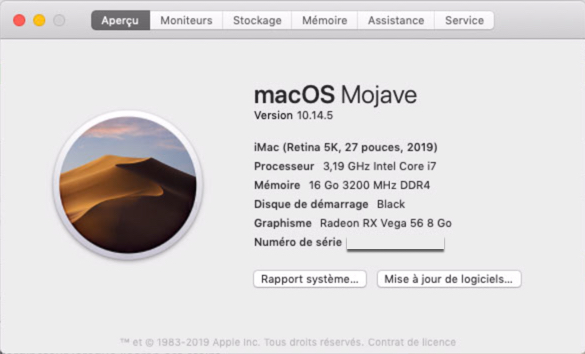
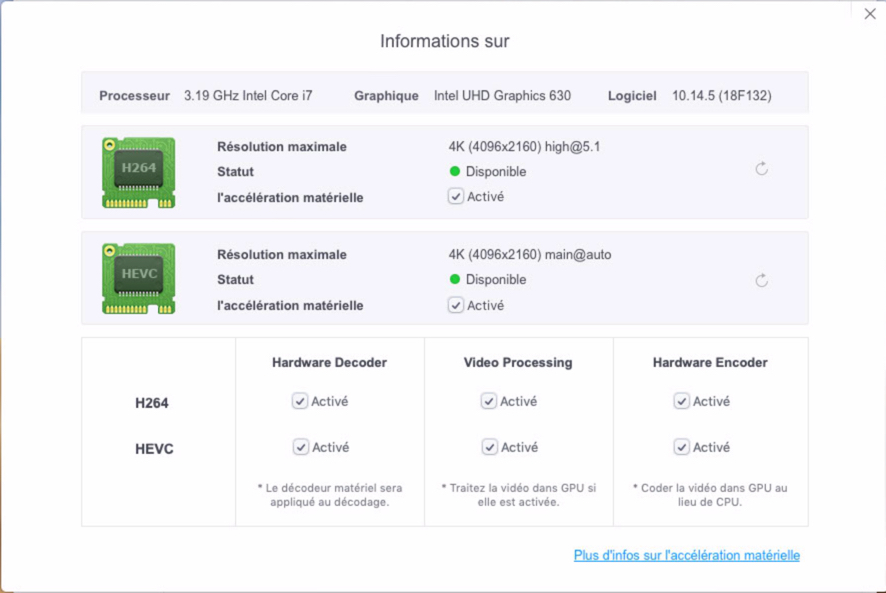

# z390-Hack based on ***Core i7-8700 | Z390 | VEGA56***

Inspiration by [Hackintosh / Vanilla](https://hackintosh.gitbook.io/-r-hackintosh-vanilla-desktop-guide/)

Sections: 
 Jump to [Hardware](./Hardware.md)
 Jump to [Software](./Software.md)

## Parts List

[PC PartPicker Part List](https://pcpartpicker.com/list/7hDRr6)

Type|Item
:----|:----
**CPU** | [Intel - Core i7-8700 3.2 GHz 6-Core Processor](https://pcpartpicker.com/product/C9hj4D/intel-core-i7-8700-32ghz-6-core-processor-bx80684i78700)
**CPU Cooler** | [be quiet! - Dark Rock 4 CPU Cooler](https://pcpartpicker.com/product/FRYLrH/be-quiet-dark-rock-4-cpu-cooler-bk021) 
**Motherboard** | [Asus - ROG STRIX Z390-F GAMING ATX LGA1151 Motherboard](https://pcpartpicker.com/product/CM7v6h/asus-rog-strix-z390-f-gaming-atx-lga1151-motherboard-rog-strix-z390-f-gaming)
**Memory** | [Corsair - Vengeance LPX 16 GB (2 x 8 GB) DDR4-3200 Memory](https://pcpartpicker.com/product/DK66Mp/corsair-vengeance-lpx-16-gb-2-x-8-gb-ddr4-3200-memory-cmk16gx4m2d3200c16) 
**Storage MVNE (for MacOS)** | [Western Digital - SN750 500 GB M.2-2280 Solid State Drive](https://pcpartpicker.com/product/KTQG3C/western-digital-sn750-500-gb-m2-2280-solid-state-drive-wds500g3x0c)
**Storage MVNE (for Win10)** | [Western Digital - Blue SN500 500 GB M.2-2280 Solid State Drive](https://pcpartpicker.com/product/2cJtt6/western-digital-blue-sn500-500-gb-m2-2280-solid-state-drive-wds500g1b0c)
**Storage SATA** | [Western Digital - Red 3 TB 3.5" 5400RPM Internal Hard Drive](https://pcpartpicker.com/product/7sTmP6/western-digital-internal-hard-drive-wd30efrx)
**Storage SATA** | [Western Digital - Red 3 TB 3.5" 5400RPM Internal Hard Drive](https://pcpartpicker.com/product/7sTmP6/western-digital-internal-hard-drive-wd30efrx)
**Video Card** | [Sapphire - Radeon RX VEGA 56 8 GB PULSE Video Card](https://pcpartpicker.com/product/cKhKHx/sapphire-radeon-rx-vega-56-2gb-pulse-video-card-11276-02-40g)
**Case** | [NZXT - H500 ATX Mid Tower Case](https://pcpartpicker.com/product/dy66Mp/nzxt-ca-h500b-ow-atx-mid-tower-case-ca-h500b-ow)
**Power Supply** | [SeaSonic - PRIME Ultra Titanium 650 W 80+ Titanium Certified Fully Modular ATX Power Supply](https://pcpartpicker.com/product/fnjJ7P/seasonic-prime-ultra-titanium-650w-80-titanium-certified-fully-modular-atx-power-supply-ssr-650tr)
**Custom** | [Fenvi Desktop Wireless Network M.2(NGFF) Wireless Card to PCI-e 1X Adapter Converter(Not Including Networking card) Compact Intel NGFF M.2 7260 8260 3160 ect Windows 7, 8, 10 Compatible](https://pcpartpicker.com/product/rpgzK8/fenvi-desktop-wireless-network-m2ngff-wireless-card-to-pci-e-1x-adapter-converternot-including-networking-card-compact-intel-ngff-m2-7260-8260-3160-ect-windows-7-8-10-compatible)
**Custom** | [ROG Addressable LED Strip (30 cm, Aura Sync RGB, magnetisch Casemod)](https://pcpartpicker.com/product/ytBTwP/rog-addressable-led-strip-30-cm-aura-sync-rgb-magnetisch-casemod)

### Working
---
* Mojave install boots successfully
* NVME - WD Black
* Display on Sapphire Pulse VEGA 56 HDMI and Display
* Wired Ethernet - Intel I219-V PCI Express Gigabit Ethernet
* USB 2.0
* USB 3.1 and USB C
* Sleep/Wake
* Quicklook
* Rear and Front audio jacks
* Youtube video
* Netflix with Chrome 
* H.264 videos via VLC (.mkv, .m4a, .m4p)
* HWMonitor (after copying required kexts to EFI)

### Not Working
---
* Netflix with Safari (ask for HTML 5 / Silverlight compatible browser)

