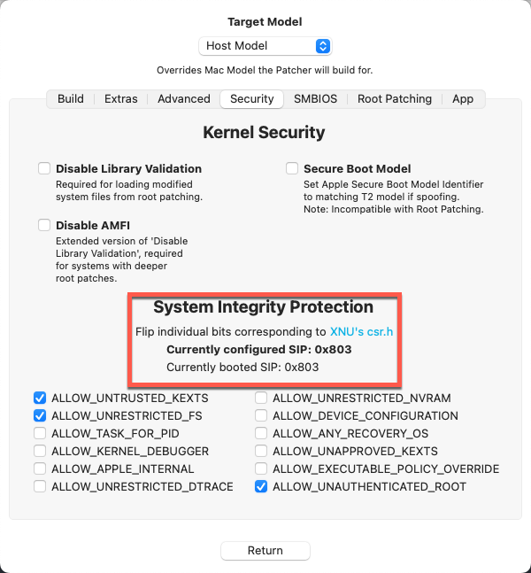
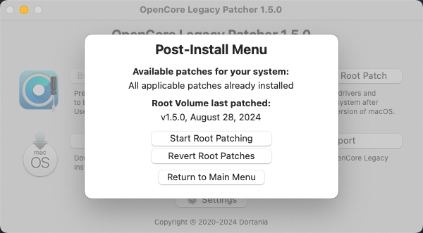

## DEVICES

#### Audio:

Here we set our audio to inject _Layout 1_ - this may or may not be compatible with your codec, but you can check on [_AppleALC's Supported Codec Page_](https://github.com/acidanthera/AppleALC/wiki/Supported-codecs).

Asus ROG SupremeFX S1220A is base on Realteck ALC1220.
Acording to Info.plist on AppleALC Github for ALC1220 layout 1 is for "Toleda - Realtek ALC1220, 5/6 audio ports, native: 2 inputs, 3/4 outputs+front panel+SPDIF/Optical"

#### Graphics:

We need to configure the HD630 iGPU in headless mode

#### Wifi:

We have to reestablished support for native Broadcom card with device-id pci12e4,43ba » BCM43602
Bluetooth works well, as in Ventura and earlier

So for getting back Wi-Fi in sonoma we have to:

- System Integrity Protection disabled: csr-active-config=03080000

- AMFI disabled: boot-args = -amfipassbeta

- Secure Boot Model = Disabled

- Block com.apple.iokit.IOSkywalkFamily, setting MinKernel to 23.0.0 to ensure the patch is applied only in Sonoma

- Inject 3 extensions (Kexts folder and config.plist): IOSkywalk.kext, IO80211FamilyLegacy.kext and AirPortBrcmNIC.kext (IO80211FamilyLegacy.kext plugin) in this order, setting MinKernel to 23.0.0 to ensure they are injected only in Sonoma

- Reboot and apply OCLP root patch (Modern Wireless Network)

